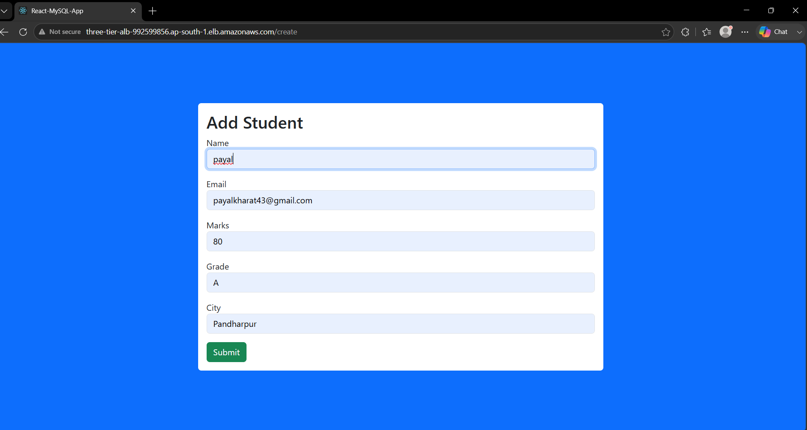
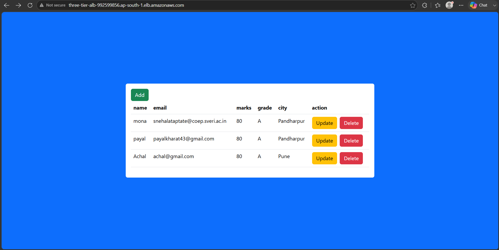
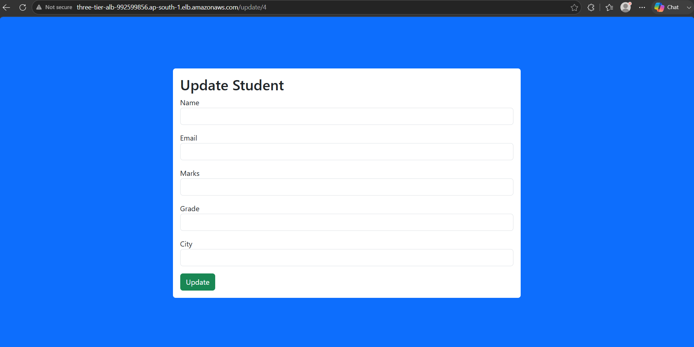
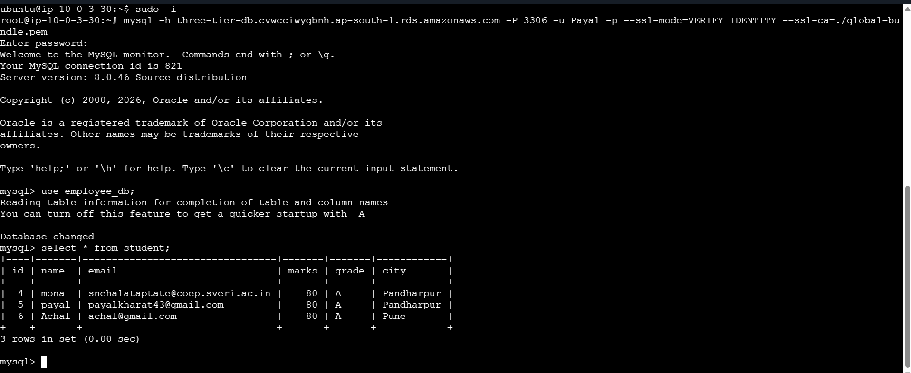

# React + Node.js CRUD Full Stack Application

A Full Stack Student Management System built using:

- React.js (Frontend)
- Node.js + Express.js (Backend)
- MySQL Database
- Docker
- Docker Compose
- NGINX
- AWS EC2
- AWS Application Load Balancer (ALB)

---

# Architecture

```
                 Browser
                    │
                    │
              ALB DNS Endpoint
                    │
                    ▼
             NGINX (Port 80)
                    │
             React Application
                    │
          /api/students
                    │
                    ▼
         Node.js + Express API
                    │
              Port 5000
                    │
                    ▼
             MySQL Database
```

---

# Features

- Add Student
- View Students
- Update Student
- Delete Student
- Dockerized Application
- NGINX Reverse Proxy
- Docker Compose Deployment
- AWS EC2 Deployment
- AWS ALB Integration

---

# Technologies Used

- React.js
- Node.js
- Express.js
- MySQL
- Axios
- Docker
- Docker Compose
- NGINX
- AWS EC2
- AWS Application Load Balancer

---

# Prerequisites

Install the following:

- Git
- Node.js
- npm
- Docker
- Docker Compose
- MySQL
- AWS EC2 Instance

---

# Clone Repository

```bash
git clone https://github.com/your-username/react-mysql-app.git

cd react-mysql-app
```

---

# Configure MySQL

Create Database

```sql
CREATE DATABASE react_sql_db;
```

Create Student Table

```sql
USE react_sql_db;

CREATE TABLE student(
    id INT AUTO_INCREMENT PRIMARY KEY,
    name VARCHAR(255),
    email VARCHAR(255),
    marks INT,
    grade VARCHAR(10),
    city VARCHAR(100)
);
```

---

# Configure Backend

Update the MySQL configuration inside

```
server.js
```

```javascript
const db = mysql.createConnection({
    host: "your-db-host",
    user: "root",
    password: "your_password",
    database: "react_sql_db"
});
```

---

# Configure React

If required, update the API URL.

```javascript
const API_URL="/api";
```

NGINX forwards API requests automatically.

---

# Docker Deployment

The application is deployed on an **AWS EC2 Instance** using Docker and Docker Compose.

Build Docker Images

```bash
docker compose build
```

Start Containers

```bash
docker compose up -d
```

Check Running Containers

```bash
docker ps
```

View Logs

```bash
docker compose logs -f
```

Stop Containers

```bash
docker compose down
```

Restart Containers

```bash
docker compose restart
```

---

# NGINX

The React production build is served using **NGINX**.

NGINX is responsible for:

- Serving the React production build
- Handling client-side routing
- Forwarding API requests to the backend
- Delivering static assets efficiently

---

# Deployment on AWS EC2

Deployment Steps

1. Launch an EC2 Instance.
2. Install Docker and Docker Compose.
3. Clone the repository.
4. Build Docker images.
5. Start the containers.
6. Access the application using the ALB DNS endpoint.

---

# Application URLs

Frontend (AWS ALB DNS)

```
http://<your-alb-dns-name>
```

Backend API

```
http://<your-alb-dns-name>/api
```

---

# Output

## Add Student



---

## Student Added Successfully




---

## Update Student



---

## Student List



---

# Deployment Flow

```
Developer
      │
      ▼
Git Clone
      │
      ▼
Configure MySQL
      │
      ▼
Update server.js
      │
      ▼
docker compose build
      │
      ▼
docker compose up -d
      │
      ▼
AWS EC2
      │
      ▼
NGINX
      │
      ▼
React Application
      │
      ▼
Node.js API
      │
      ▼
MySQL Database
```

---

# Useful Docker Commands

```bash
docker compose up --build

docker compose up -d

docker compose down

docker compose logs -f

docker ps

docker images
```

---

# Ports

| Service | Port |
|----------|------|
| React (NGINX) | 80 |
| Node.js | 5000 |
| MySQL | 3306 |

---

# Author

**Payal Kharat**

AWS | Docker | React | Node.js | Express.js | MySQL | DevOps
